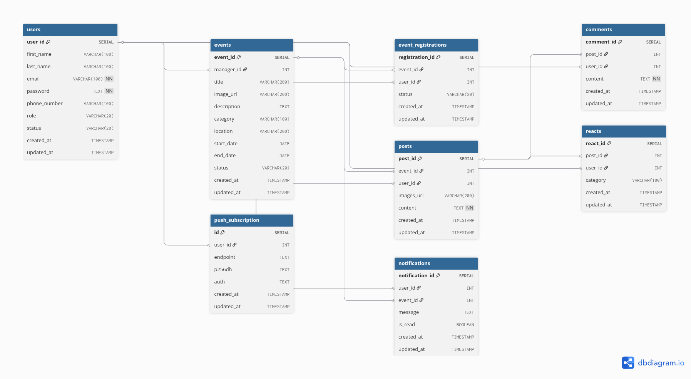

# Volunteer Hub - Nền tảng Kết nối Tình nguyện

## 1. Giới thiệu
Dự án này là bài tập lớn cho Khóa học Lập trình Ứng dụng web UET. **Volunteer Hub** là một nền tảng web được thiết kế để kết nối các tình nguyện viên với các tổ chức và sự kiện cộng đồng. Website cho phép các nhà quản lý (Manager) tạo và quản lý các sự kiện, trong khi các tình nguyện viên (Volunteer) có thể dễ dàng tìm kiếm, đăng ký và theo dõi các hoạt động thiện nguyện mà họ quan tâm. Mục tiêu của dự án là xây dựng một cộng đồng tình nguyện gắn kết, minh bạch và hiệu quả.

Yêu cầu bài tập: https://itest.com.vn/lects/webappdev/mockproj/VolunteerHub.htm

Một vài tài khoản trong dữ liệu công khai:
- Admin: admin@gmail.com, password: ngocdo
- Manager: manager@gmail.com, password: ngocdo
- Volunteer: phamdo@gmail.com, password: ngocdo

## 2. Thành viên nhóm
Dự án được thực hiện bởi nhóm 3 thành viên:
1. Phạm Ngọc Đô - 22022154 - Leader
2. Nguyễn Quang Duy - 22022148 - Member
3. Đoàn Đức Minh - 22022135 - Member

## 3. Công nghệ sử dụng

### Backend (Server)
- **Ngôn ngữ**: Python 3.12
- **Framework**: FastAPI
- **ORM**: SQLAlchemy
- **WebPush**: PyWebPush

### Frontend (Client)
- **Ngôn ngữ**: HTML5, CSS3, JavaScript
- **Thư viện hỗ trợ**: 
  - FontAwesome
  - Google Fonts

### Database
- **Hệ quản trị**: Postgres 

### DevOps & Tools
- **Containerization**: Docker, Docker Compose
- **Version Control**: Git

## 4. Thiết kế Database
Cấu trúc cơ sở dữ liệu của dự án được mô tả trong biểu đồ dưới đây:



## 5. Hướng dẫn chạy dự án

Bạn có thể chạy dự án theo 2 cách: Thủ công hoặc sử dụng Docker.

### Cách 1: Chạy thủ công (Manual)

**Yêu cầu**: Python 3.10+ đã được cài đặt.

1.  **Cài đặt thư viện Python**:
    Mở terminal tại thư mục gốc của dự án và chạy:
    ```bash
    cd backend
    pip install -r requirements.txt
    ```

2.  **Cấu hình môi trường**:
    Tạo file `.env` từ file `.env.example` (nếu có) hoặc đảm bảo các biến môi trường cần thiết được thiết lập (VAPID keys cho WebPush, Database URL,...).

3.  **Khởi chạy Backend Server**:
    ```bash
    python backend/src/main.py
    ```
    Server sẽ chạy tại: `http://localhost:8000`

4.  **Chạy Frontend**:
    ```bash
    cd frontend
    npm install
    npm start
    ```

### Cách 2: Chạy bằng Docker (Khuyên dùng)

**Yêu cầu**: Docker và Docker Compose đã được cài đặt.

1.  **Build và chạy container**:
    Mở terminal tại thư mục gốc và chạy lệnh:
    ```bash
    docker-compose up --build
    ```

2.  **Truy cập ứng dụng tại localhost**:
    - **Frontend**: http://localhost:3000
    - **Backend API Docs**: http://localhost:8000/docs

## 6. Liên hệ
Mọi thắc mắc hoặc đóng góp vui lòng liên hệ:
- **Email**: ngocdo992k4@gmail.com